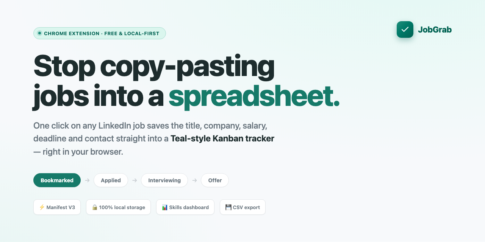
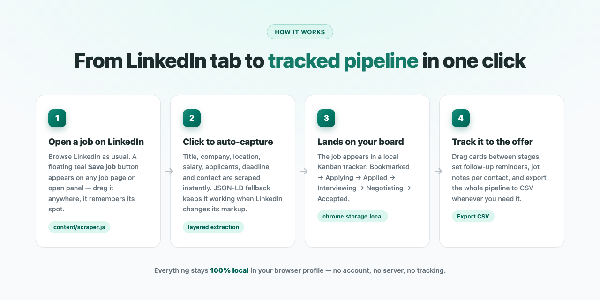
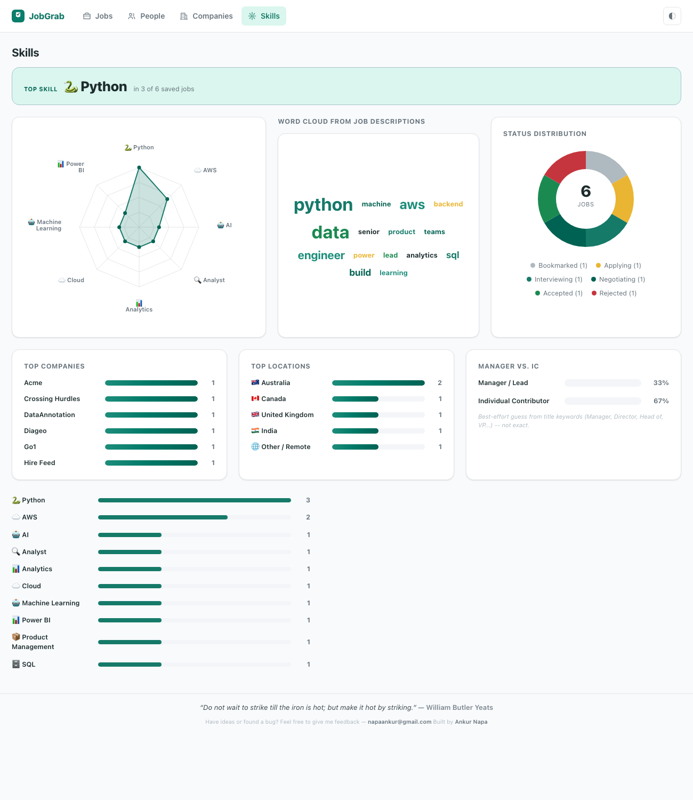

# JobGrab — LinkedIn Job Tracker (v0.2)

A Teal-style job-search companion. Sit on a LinkedIn job page, click **Save job**, and it grabs the title, company, location, salary, description snapshot, and job ID into a local Kanban tracker — plus a Skills dashboard with a spider chart, word cloud, and status breakdown of your whole search.

## What it solves

Job hunting on LinkedIn means constantly context-switching to a spreadsheet: copying the title, company, salary, deadline, and recruiter contact by hand for every job you're considering — and that spreadsheet drifts out of date the moment you stop maintaining it. JobGrab removes the copy-paste step entirely: one click on a LinkedIn job page captures everything automatically into a proper Kanban pipeline (Bookmarked → Applying → Applied → Interviewing → Negotiating → Accepted, or Rejected/Ghosted), with follow-up reminders and notes attached to each job — all stored locally in your own browser, no account or server involved. A dedicated Skills tab then rolls all of that up into a dashboard: which skills show up most across the titles you've saved, a word cloud from the actual job descriptions, a status-distribution donut, and your top companies by job count.

## How it works

1. **Open a job on LinkedIn** — a floating teal "Save job" button appears on any job page or open panel.
2. **Click to auto-capture** — `content/scraper.js` reads the page (current selectors, with a JSON-LD `JobPosting` fallback so it keeps working when LinkedIn changes its markup).
3. **Lands on your board** — saved to `chrome.storage.local`, deduped by LinkedIn job ID.
4. **Track it to the offer** — drag cards between pipeline stages, add notes/contacts, set follow-up dates, export to CSV anytime.

## How this was made

Built as a Manifest V3 Chrome extension with a layered architecture: a content script (`content/scraper.js` + `content/inject.js`) handles page scraping and the floating save button with a `MutationObserver` to survive LinkedIn's single-page-app navigation; a stateless `background/service-worker.js` routes messages between the popup, content script, and tracker; and `lib/store.js` is a thin persistence layer over `chrome.storage.local` with schema migration on read. The tracker board (`app/`) and quick-add panel are vanilla HTML/CSS/JS — no framework — rendered in a Shadow DOM on the LinkedIn page so the host site's CSS can't distort the UI. Built with [Claude Code](https://claude.com/claude-code).

## Screenshots

| Tracker board | Toolbar popup |
|---|---|
|  |  |

The tracker board (`app/index.html`) lists saved jobs with search, status pipeline, and CSV export. The toolbar popup gives a one-click shortcut to open the full tracker. Both fill in with your saved jobs as soon as you start clicking **Save job** on LinkedIn — screenshots above show the empty starting state.

## Install (Load unpacked)

1. Open `chrome://extensions` in Chrome.
2. Toggle **Developer mode** on (top right).
3. Click **Load unpacked** and select this folder: `~/Desktop/teal-linkedin-tracker`.
4. Pin the JobGrab icon from the extensions menu.

## Use

1. Go to LinkedIn. A teal **JobGrab** button (with its icon) floats at the bottom-right on every LinkedIn page.
   - On a job page (`/jobs/view/...`, or a search/collections panel with a job open) it reads the job. Off a job page it shows **Open a job**.
   - **Drag the button anywhere** — its position is remembered — so it never gets stuck under LinkedIn's messaging bubble.
2. Click it to save. If you switch jobs in the SPA panel, it re-syncs and shows **Saved** for ones you already have.
3. Click the toolbar icon for a quick view, or **Open tracker** for the full board.
4. In the tracker: drag cards between columns (Bookmarked → Applied → Interviewing → Offer → Rejected), click a card to edit status/notes, and **Export CSV**.

## If you don't see the button

Content-script changes need **both** reloads:

1. `chrome://extensions` → find JobGrab → click the **↻ reload** icon.
2. **Reload the LinkedIn tab** (Cmd+R). The button only injects on a fresh page load.
3. Open DevTools console on LinkedIn and look for `[JobGrab]` logs — `started on ...` and `button mounted` confirm it is running. `Reload page` on the button means you reloaded the extension while the tab was open — just refresh the tab.

## What it captures (Teal-style record)

Auto-scraped from LinkedIn where available, all editable:
title, company, company URL, location, workplace type (Remote/Hybrid), employment type,
applicants, salary, **job URL**, **apply URL**, posted date, **last date to apply (deadline)**,
**contact person + their title + LinkedIn profile URL**, and the full job description snapshot.
Plus your own tracking: status (pipeline), excitement rating, notes, applied date, follow-up date.

## The inline panel

Clicking the floating button opens an editable quick-add panel (rendered in a Shadow DOM so
LinkedIn's CSS can't distort it). It prefills from the page, lets you type the deadline / contact /
notes on the spot, and upserts — re-saving a job with a newly entered deadline updates the record.
A short chime + pop animation confirms each save (respects `prefers-reduced-motion`).

## The tracker (Teal-style)

Left job list + right detail pane with a clickable **chevron status pipeline**
(Bookmarked → Applying → Applied → Interviewing → Negotiating → Accepted → Rejected → Ghosted), a star
excitement rating, tabbed sections (Job Info, Notes, Contacts, Description), and a **Dates** row
(Posted / Saved / Deadline / Applied / Follow up). Every field autosaves; deadlines within 7 days
are highlighted. Export everything to CSV (UTF-8, Excel-safe). Status pills and the pipeline summary
cards are color-coded per stage (amber while applying/negotiating, green once accepted, red if
rejected, muted gray if ghosted) so where things stand reads at a glance.

## Skills dashboard

A fourth nav tab rolls your saved jobs up into a dashboard, built entirely from data you already
captured — no extra tagging required:

- **Top skill callout + spider chart** — a fixed keyword dictionary (Python, SQL, AWS, Product
  Management, etc.) is matched against every saved job **title** (titles are always captured;
  descriptions aren't every time), counted, and the top 8 plotted on a radar chart.
- **Word cloud from job descriptions** — a broader, unfiltered view of whatever language actually
  shows up in the full description snapshots (when captured from an open job page), stop-words
  filtered out, sized by frequency.
- **Status distribution donut** — every saved job's current pipeline stage, color-matched to the
  same palette used in the table and pipeline summary.
- **Top companies bar chart** — which companies you've saved the most jobs from.

All four charts are hand-rolled inline SVG/CSS — no charting library — and follow the app's
light/dark theme automatically.

## How it works

- `content/scraper.js` — layered extraction: current LinkedIn selectors → JSON-LD `JobPosting` → URL/meta fallback. Never throws; degrades gracefully when LinkedIn changes its DOM.
- `content/inject.js` — floating button + `MutationObserver` to survive LinkedIn's single-page navigation.
- `background/service-worker.js` — stateless message router (MV3 workers are ephemeral).
- `lib/store.js` — `chrome.storage.local` persistence, dedup by LinkedIn job ID.
- `app/` — the tracker board UI (named `app/` not `tracker/` because ad/privacy blockers block URLs containing "tracker"). Scraped descriptions render as **plain text** (never raw innerHTML) to avoid XSS.

## Roadmap

- **Phase 3 — Resume Match Score:** upload resume (PDF via pdf.js), local keyword/skill overlap score shown on each job. Deterministic and private by default; optional Claude-assisted semantic gap analysis + bullet tailoring behind an API key.
- **Later:** more boards (Indeed, Greenhouse, Lever) via the same adapter pattern; reminders via `chrome.alarms`; optional cloud sync; import/export against your existing `.xlsx` job trackers.

## Known limits (v1)

- LinkedIn only. Selectors may drift; the JSON-LD fallback cushions most breaks.
- Salary shows only when LinkedIn exposes it on the page.
- Storage is local to this browser profile (no sync yet). Use Export CSV to back up.
